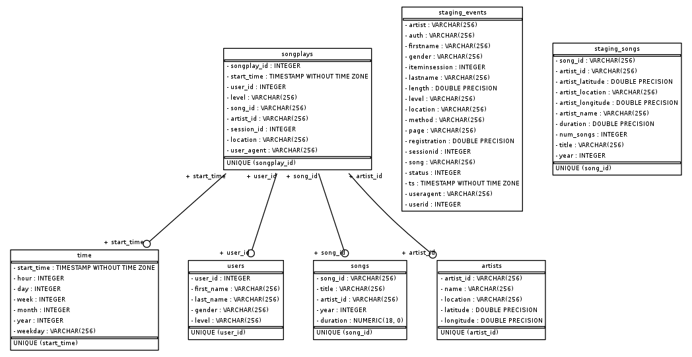

## Introduction

A music streaming startup, Sparkify, has grown their user base and song database and want to move their processes and data onto the cloud. Their data resides in S3, in a directory of JSON logs on user activity on the app, as well as a directory with JSON metadata on the songs in their app.

As their data engineer, we are tasked with building an ETL pipeline that extracts their data from S3, stages them in Redshift, and transforms data into a set of dimensional tables for their analytics team to continue finding insights in what songs their users are listening to. We'll be able to test our database and ETL pipeline by running queries given to us by the analytics team from Sparkify and compare our results with their expected results.

## Project Description

In this project, we'll apply what we've learned on data warehouses and AWS to build an ETL pipeline for a database hosted on Redshift. To complete the project, we will need to load data from S3 to staging tables on Redshift and execute SQL statements that create the analytics tables from these staging tables.

## Project Datasets

We'll be working with two datasets that reside in S3. Here are the S3 links for each:

* Song data: 
    s3://udacity-dend/song_data
    
* Log data: 
    s3://udacity-dend/log_data
    
* Log data json path: 
    s3://udacity-dend/log_json_path.json


## Song dataset

The first dataset is a subset of real data from the Million Song Dataset. Each file is in JSON format and contains metadata about a song and the artist of that song. The files are partitioned by the first three letters of each song's track ID.  Here is an example of song file:

    {"num_songs": 1, "artist_id": "ARJIE2Y1187B994AB7", "artist_latitude": null, "artist_longitude": null, "artist_location": "", "artist_name": "Line Renaud", "song_id": "SOUPIRU12A6D4FA1E1", "title": "Der Kleine Dompfaff", "duration": 152.92036, "year": 0}


## Log Dataset
The second dataset consists of log files in JSON format generated by event simulator based on the songs in the dataset above. These simulate activity logs from a music streaming app based on specified configurations.

The log files in the dataset we'll be working with are partitioned by year and month. Here is an example of log file:


## Discuss the purpose of this database in the context of the startup, Sparkify, and their analytical goals.

This database is extremely useful in the context of the startup, Sparkify, to analyze the user behaviours and improve the user experiences when they use the app.

For example, it could provide rankings e.g. popular songs, popular artists, etc.

In addition, the user behaviour could be identified, i.e. how much they will listen on each day, if they like to hear more on weekdays or weekends, how many would like to become a paid user, etc.

Therefore, the database provides a foundation for further data analysis processes.

## State and justify database schema design and ETL pipeline.

The star scheme is used for this database. It consists of one fact table (songplays) and references to four dimention tables (users, songs, artists, time).

**songplays**  - records in log data associated with song plays i.e. records with page NextSong
* songplay_id, start_time, user_id, level, song_id, artist_id, session_id, location, user_agent

**users** - users in the app
* user_id, first_name, last_name, gender, level

**songs** - songs in music database
* song_id, title, artist_id, year, duration

**artists** - artists in music database
* artist_id, name, location, latitude, longitude

**time** - timestamps of records in songplays broken down into specific units
* start_time, hour, day, week, month, year, weekday

These could be seen from


ETL pipeline starts from copying from song and log dataset on S3 which include the details of the user behaviours and the songs that the user could listen to, and loading them into staging tables, then inserts data from staging tables into analytica tables. The fact table (songplays) provides the metric of the business process (here the user activity in the app). Further analysis could be proceeded with queries in the database.

## Provide example queries and results for song play analysis.

In queries.ipynb, after checking the connection and if the data is loaded into the table, some example queries are executed.

For example, it is found that users listen to the music mostly on Wednesdays, and least on weekends (Saturday and Sunday); it is found that Nick Cave & The Bad Seeds have 16 songs that are included in the database, that are most among all artists.

So perhaps the company could make more advertisements on weekdays since there are more users to be reached, and promote more on using the app on weekends to attract more users:) 


**Remember to restart "queries.ipynb" to close the connection and delete the redshift cluster when finished.


## Repository files

**img** contains images for README.md

**sql_queries.py** contains SQL queries for dropping and creating tables, and coping queries and inserting queries to load data into tables.

**create_tables.py** contains code for connecting to Amazon Redshift, setting up database, droping old tables (if exist) and creating the staging and fact&dimension tables.

**etl.py** contains code for executing the queries which load JSON data from S3 bucket into staging tables on Redshift, then insert the data into analytics tables on Redshift

**dwh.cfg** is the configuration file contains information about Redshift, IAM, and the location of S3 files. 

**queries.ipynb** contains sample queries after the data is loaded into the tables, to make sure the the whole process is right.

**ER_diagram.py** contains the python script to generate ER diagram for the databases.

## How to run

Create the table (drop the tables if existed), and load data from S3 to staging tables, insertfrom staging tables to analytical tables. They can be done by running:

```
python create_tables.py 
python etl.py 
```