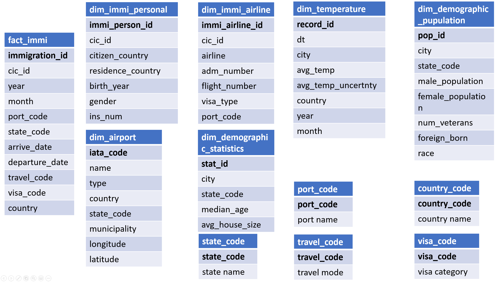
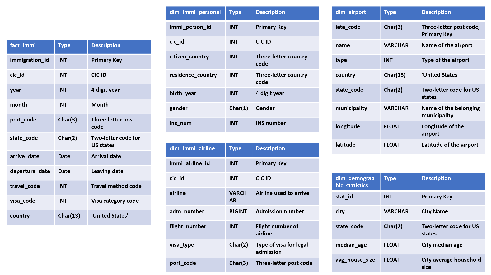
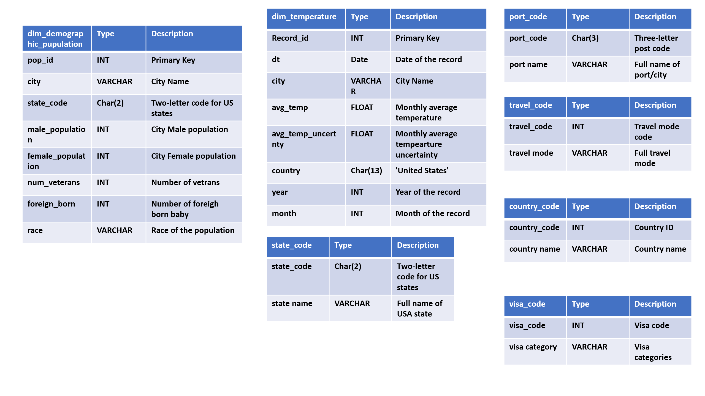

# Project Title
### Data Engineering Capstone Project

#### Project Summary

The project follows the follow steps:
* Step 1: Scope the Project and Gather Data
* Step 2: Explore and Assess the Data
* Step 3: Define the Data Model
* Step 4: Run ETL to Model the Data
* Step 5: Complete Project Write Up


### Step 1: Scope the Project and Gather Data

#### Scope 
This project will integrate I94 immigration data, world temperature data, US demographic data and Airport Code Table to setup a data warehouse with fact and dimension tables.

#### Describe and Gather Data 
1. [I94 Immigration Data](https://travel.trade.gov/research/reports/i94/historical/2016.html), SAS. The dataset contains international visitor arrival statistics by world regions and select countries, type of visa, mode of transportation, age groups, states visited, and the top ports of entry.
2. [World Temperature Data](https://www.kaggle.com/berkeleyearth/climate-change-earth-surface-temperature-data), CSV. This dataset is from Kaggle and contains average temperature data each month at different country in the world.
3. [U.S. City Demographic Data](https://public.opendatasoft.com/explore/dataset/us-cities-demographics/export/), CSV. This dataset contains information about the demographics of all US cities and census-designated places (population>= 65,000).
4. [Airport Code Table](https://datahub.io/core/airport-codes#data), CSV. This dataset contains either IATA airport code, a three-letter code which is used in passenger reservation, ticketing and baggage-handling systems, or the ICAO airport code which is a four letter code used by ATC systems and for airports that do not have an IATA airport code.

### Step 2: Explore and Assess the Data
#### Exploration
1. Use pandas for exploratory data analysis to get an overview on these data sets
2. Split data sets to dimensional tables and change column names for better understanding

#### Cleaning
1.Immigration Data:
* get the corresponding code and name/detail for country, visa, port(city/state) information from I94_SAS_Labels_Descriptions.SAS
* Transform arrive_date, departure_date in immigration data from SAS time format to pandad datetime format
2.Demografic Data Set
* Upper Case city so it could match the port_code dataframe
3.Airport Dataset
* Transform the coordiantes into longitude and latitude
* Remove country code in the state

### Step 3: Define the Data Model
#### 3.1 Conceptual Data Model
Since the purpose of this data warehouse is for OLAP and BI app usage, these data sets will be modelled with star schema into a fact table and several dimension tables.
Details could be seen from this figure:



#### 3.2 Mapping Out Data Pipelines
1. Althrough all data sets are provided locally, we may assume all data sets are stored in S3 buckets as below
##### [Source_S3_Bucket]/immigration/18-83510-I94-Data-2016/*.sas7bdat
##### [Source_S3_Bucket]/I94_SAS_Labels_Descriptions.SAS
##### [Source_S3_Bucket]/temperature/GlobalLandTemperaturesByCity.csv
##### [Source_S3_Bucket]/demography/us-cities-demographics.csv
2. Follow by Step 2 – Cleaning step to clean up data sets:
##### Transform immigration data to 1 fact table and 2 dimension tables, fact table will be partitioned by state
##### Parsing label description file to additional tables to document the codes and names
##### ----
##### Transform temperature data to dimension table
##### Filter only for US which are relevent for this datawarehouse
##### ----
##### Split demography data to 2 dimension tables
##### Upper case the state and port name where additional tables created above will also help here
##### Depending on the usage, further aggregation may be applied here too
##### ----
##### Transform airport data to dimension table
##### Filter only for US and non-iata rows
##### Split to get the coordinates and clean the state code

3. Store these tables back to local repositories (or target S3 bucket)

### Step 4: Run Pipelines to Model the Data 
#### 4.1 Create the data model
Build the data pipelines to create the data model.
Refer to and run etl.py for the cleaned and entire process.
Make sure that the type of the columns are in the right type before loading.

#### 4.2 Data Quality Checks
These could include:
 * Integrity constraints on the relational database (e.g., unique key, data type, etc.)
 * Unit tests for the scripts to ensure they are doing the right thing
 * Source/Count checks to ensure completeness
 
#### 4.3 Data dictionary 



#### 4.4 Example analysis
The result tables could be used for many users and on many questions, i.e. sociologists who want to study the trend of immigration data to US, to identify which country provides the largest number of immigrants, which state in US is the most favorite places for immigrants, how the distributions of age look like for the immigrants, etc.

A few example analysis could be referred to step 4.4 in "Capstone Project.ipynb" notebook (last several cells).

It could be found that most immigrants are from UK, Japan, China, etc., and most destinated states are Florida, New York, California, and the most of the people are born in 1980s, etc.

Further analysis (2nd dimension anlysis) is also available, an example could be to check the gender of the immigrants for those countries where most immigrants are from, i.e. it is found that UK and Japan have more male immigrants than female, whereas it is opposite in China which has more female immigrants.

### Step 5: Complete Project Write Up
#### Clearly state the rationale for the choice of tools and technologies for the project.
1. AWS S3 for storage (both source and target)
2. Pandas and Numpy for data exploration and analysis
3. PySpark for large data set data processing to extract, transform and load tables

#### Propose how often the data should be updated and why.
1. Tables created from immigration and temperature dataset should be updated everyone month since the raw data is build based on the month.
2. Tables created from demography data set could be updated annually since it takes time for data collection and insufficient data might lead to inappropriate conclusions compared with those that drawn from more complete dataset.
3. For all tables during the update, it should proceed with "append" mode.

#### Suggestions for following scenarios:
 1. The data was increased by 100x.
   If the data was increased by 100x, and if spark standalone server mode can not process, we could consider to put data in AWS EMR which is a distributed data cluster for processing large data sets on cloud
 
 2. The data populates a dashboard that must be updated on a daily basis by 7am every day.
   This could be helped with AWS airflow. With the argument "schedule_interval" set as '7 0 * * *', the entire process will be executed 7am every day hence the tables could be updated.
   
 3. The database needed to be accessed by 100+ people.
   If the database needed to be accessed by 100+ people, one way is to load the tables into a cloud based database which could support these connections. For example, AWS redshift could handle up to 500 connections, however the cost needs to be considered here since with such connection requirement, the AWS redshift has to be available all the time.
   
#### Other thoughts

1. Temperature dataset is not up to the latest. During the exploration, it is realized that no data is available for year 2016 which is the time for our fact table.

2. During the integrity check, it is found that some of the state names do not appear in the label descriptions. Further actions might be needed here.

3. Port code might not be 100% equivalent to the city code, and it is tried to build a reverse table to link the city to the code in the label descriptions, however many cities does not have the corresponding codes hence for the demographic data, we have to leave with the full city name.


## Repository files

```
workspace
|____img                       # images for READMD and ipynb notebook
|
|____output                    # local repositories of output parquet files for ETL process
|
|____sas_data                  # local parquet output for sample immigration data
|  
|____airport-codes_csv.csv     # local source file for airport dataset
| 
|____aws.cfg                   # AWS configuration file
| 
|____Capstone Project.ipynb    # Ipython notebook contains detailed steps on the ETL process for each of the tables
|
|____etl.ipynb                 # python script reads and processes files and loads them into  tables
|
|____I94_SAS_Labels_Descriptions.SAS     # Label descriptions in SAS format
|
|____immigration_data_sample.csv         # Sample immigration raw dataset in CSV format
|
|____local_to_S3.csv          # helper python script to upload local parquet files into S3, not necesssary since this could be directly achieved | |                               in etl.py
|
|____README.md                      # README file
|
|____us-cities-demographics.csv         # Demographic raw dataset in CSV format


```